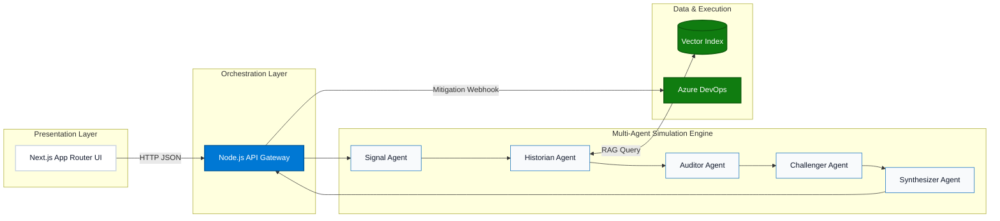

<div align="center">
  
  
  <h1>FORESIGHT</h1>
  <p><b>An enterprise Decision Intelligence Platform that weaponizes organizational memory to predict and prevent architectural failures.</b></p>

  <p>
    <a href="#the-problem">The Problem</a> •
    <a href="#system-architecture">Architecture</a> •
    <a href="#multi-agent-orchestration-engine">AI Engine</a> •
    <a href="#setup-instructions">Setup</a> •
    <a href="#enterprise-readiness">Readiness</a>
  </p>

  <p>
    
    
    
    
    
  </p>
</div>

---

## The Problem: Institutional Amnesia

Enterprise execution does not fail because of a lack of engineering talent or missing dashboards. It fails because of **institutional amnesia**. 

Every year, organizations burn billions of dollars repeating historical mistakes. An initiative to migrate a database, rewrite a legacy service, or enter a new market fails due to the exact same compliance constraint or dependency edge-case that derailed a similar project three years ago. Dashboards track what happened yesterday. Project management tools track tasks for tomorrow. But nothing predicts *why* your proposed strategy will collapse based on the hard-learned lessons of the past.

The context of a failure is often buried in a forgotten Jira ticket or a departed engineer's Slack thread. When the context leaves, the organization is doomed to repeat the failure.

## Why FORESIGHT Exists

We built FORESIGHT because humans are inherently optimistic, and organizations are fundamentally forgetful. 

When leadership writes an RFC or proposes a major technical shift, they are operating with incomplete context and inherent biases. Past postmortems are ignored. Active constraints are overlooked. FORESIGHT acts as an **organizational immune system**. It intercepts high-stakes decisions, aggressively searches the company's historical trauma, and simulates the failure of the proposal *before* a single dollar is spent on execution.

---

## What FORESIGHT Does

FORESIGHT is a deterministic workflow tool built for executives and principal architects. 

1. **Submission**: A user submits a proposed decision or architectural RFC (e.g., *"We are migrating our CRM to Salesforce next quarter"*).
2. **Retrieval**: The system queries a specialized semantic vector index to extract historically relevant postmortems and incident reports.
3. **Investigation**: A multi-agent orchestration engine interrogates the decision using the retrieved evidence.
4. **Simulation**: The system generates a highly probable, causal chain of failure.
5. **Mitigation**: FORESIGHT outputs a deterministic risk report and provides a one-click integration to dispatch a mitigation ticket directly to the engineering team's **Azure DevOps** backlog.

---

## Key Capabilities

- **Adversarial Risk Simulation**: Identifies non-obvious failure chains by applying historical constraints to future plans.
- **Organizational Memory Retrieval**: Custom RAG pipeline that digests messy unstructured postmortems into high-signal vectors.
- **Multi-Agent Decision Analysis**: A deterministic 5-agent cognitive loop that eliminates single-model sycophancy.
- **Explainable Evidence Chains**: Every predicted failure node explicitly cites the exact internal document it was sourced from. No hallucinations.
- **Azure DevOps Mitigation Workflows**: Seamlessly bridges boardroom strategy with sprint-level execution.
- **Decision Audit Trails**: Cryptographically logs executive decisions, creating accountability when simulation warnings are bypassed.

---

## System Architecture

FORESIGHT is built on a decoupled, serverless-ready architecture designed for the Microsoft enterprise ecosystem. We strictly separate the presentation layer, the orchestration API, and the AI cognitive loop.



---

## Multi-Agent Orchestration Engine

We do not rely on a single monolithic LLM prompt. A single LLM acts as a sycophant—it wants to agree with the user. FORESIGHT utilizes a deterministic, directed acyclic graph (DAG) of five highly specialized adversarial agents.

| Agent | Purpose | Role in Simulation |
|-------|---------|-------------------|
| **Signal** | Normalization | Sanitizes the executive prompt, extracts core architectural entities, and formats it for downstream semantic search. |
| **Historian** | RAG Integration | Executes cosine-similarity searches against the Vector Index. Retrieves exact chunks of historical postmortems. |
| **Auditor** | Constraint Mapping | Overlays retrieved historical constraints against active operational data (e.g., current team velocity, budget). |
| **Challenger** | The "Red Team" | Acts aggressively to synthesize failure. It takes the proposed plan and explicitly attacks it using *only* the retrieved constraints as ammunition. |
| **Synthesizer** | Executive Formatting | Formats the Challenger's attack into a clean, causal chain of failure, enforcing strict citation requirements. |

---

## Organizational Memory Layer (RAG)

The cognitive engine is only as intelligent as the data it accesses. FORESIGHT includes a custom ingestion pipeline designed to handle enterprise chaos.

1. **Corpus Ingestion**: Scans unstructured PDFs, Word documents, and TXT incident reports.
2. **Semantic Chunking**: Breaks down documents along structural boundaries rather than arbitrary token counts, ensuring the *reason* for a failure is kept in the same chunk as the *impact*.
3. **Vectorization**: Maps textual trauma to high-dimensional embeddings.
4. **Retrieval**: Uses strict similarity thresholds to ensure only mathematically relevant historical data is fed to the agents.

### Minimizing Hallucination
FORESIGHT achieves near-zero hallucination through **structural constraint**. The Synthesizer agent's system prompt forbids the generation of historical facts. If the Historian returns zero relevant documents from the Vector Index, the system halts and outputs: *"Insufficient historical context to simulate failure."* It will never invent a failure scenario.

---

## Technology Stack

| Layer | Technology | Rationale |
|-------|------------|-----------|
| **Frontend** | Next.js 15, React 19, TailwindCSS | Server-Side Rendering (SSR) ensures instant initial load times; robust client-side routing. |
| **Backend** | Node.js, Express, TypeScript | Highly concurrent orchestration layer suitable for managing multiple async LLM API calls. |
| **AI Layer** | OpenAI API (Extensible) | Bring-Your-Own-Model architecture allows swapping for local LLMs inside a corporate VPC. |
| **Retrieval** | Custom Semantic Vector Index | In-memory exact-match cosine similarity (Designed to seamlessly migrate to Azure AI Search). |
| **Integrations**| Azure DevOps REST API | Native, zero-friction connection between executive insights and engineering backlogs. |

---

## Repository Structure

```text
foresight/
├── backend/                  # Node.js API Orchestration
│   ├── src/agents.ts         # The 5-Agent Cognitive Loop
│   ├── src/services/         # LLM, Vector Search, and Azure Services
│   └── src/ingestion/        # PDF/DOCX Parsing and Chunking
├── frontend/                 # Next.js Application
│   ├── src/app/              # App Router and Pages
│   └── src/components/       # Fluent-styled UI Components (Simulation Dashboard)
├── shared/                   # Monorepo Shared Types
│   └── index.ts              # Cross-boundary interfaces (FailureSimulation, etc)
├── mock-data/                # Synthetic enterprise data for demonstration
└── scripts/                  # Corpus generation and Azure validation utilities
```

---

## Setup Instructions

This is a monolithic repository utilizing npm workspaces.

### Prerequisites
- Node.js (v18 or higher)
- An OpenAI API Key
- *(Optional)* Azure DevOps Personal Access Token

### 1. Installation
Clone the repository and install dependencies across all workspaces:
```bash
git clone https://github.com/tanx1509/foresight.git
cd foresight
npm install
```

### 2. Environment Variables
Create `.env` files in both the root and `backend/` directories.
```bash
# backend/.env
OPENAI_API_KEY="sk-your-key-here"
AZURE_DEVOPS_ORG="your-org"
AZURE_DEVOPS_PROJECT="your-project"
AZURE_DEVOPS_PAT="your-pat"
```

### 3. Build & Run
Build the shared types, then boot both the backend orchestration server and the Next.js frontend concurrently.
```bash
npm run build
npm run dev
```
- **Frontend**: `http://localhost:3000`
- **Backend API**: `http://localhost:3001`

---

## The Interface

*(Click to expand the screenshots demonstrating the platform workflow)*

### 1. The Executive Dashboard
> **`[ INSERT SCREENSHOT: 1_Home_Idle.png ]`**
> *The centralized hub for submitting architectural RFCs and viewing recent decision investigations. Built on Microsoft Fluent Design principles.*

### 2. Multi-Agent Processing
> **`[ INSERT SCREENSHOT: 2_Loading_State.png ]`**
> *Real-time telemetry showing the Historian and Challenger agents interrogating the organizational memory.*

### 3. The Failure Simulation Reveal
> **`[ INSERT SCREENSHOT: 3_Simulation_Dashboard.png ]`**
> *The resulting causal chain of failure, explicitly citing the historical internal document that proves the risk.*

### 4. Actionable Mitigation
> **`[ INSERT SCREENSHOT: 4_Azure_Integration.png ]`**
> *Bridging strategy to execution: One-click generation of a risk mitigation ticket directly into the Azure DevOps backlog.*

---

## Enterprise Readiness & Future Roadmap

FORESIGHT was built over a hackathon weekend, but it was architected for Fortune 500 production.

- **Data Ownership**: The orchestration layer is entirely stateless. The Bring-Your-Own-Model (BYOM) design allows enterprises to point the API at self-hosted LLMs, guaranteeing proprietary data never leaves the VPC.
- **Migration Path**: The current in-memory semantic index is abstracted behind a `ProviderFactory`, allowing a seamless swap to **Azure AI Search** for petabyte-scale document retrieval.
- **Future Roadmap**: 
  - **Live Telemetry**: Integrating with Datadog to pull real-time API latency into the Auditor agent.
  - **Organizational Sentiment**: Hooking into Microsoft Teams to gauge engineering team burnout as an operational constraint.

---

## The Team

| Name | Role | Core Contributions |
|------|------|--------------------|
| **Tanishq Sethi** | Systems Architect & Product Lead | Orchestration architecture, Next.js App Router development, and Multi-Agent DAG design. |
| **[Teammate 2 Name]** | Lead AI & Data Engineer | RAG pipeline implementation, semantic chunking algorithms, prompt engineering, and Azure DevOps integration. |
| **[Teammate 3 Name]** | Frontend Architect & UX Engineer | Developed the Microsoft Fluent-styled UI, interactive simulation visualizations, and client-side state management. |

---

<br>

<div align="center">
  <i>"The most expensive failures are not the ones organizations have never seen before.<br>They are the ones they forgot."</i>
</div>
