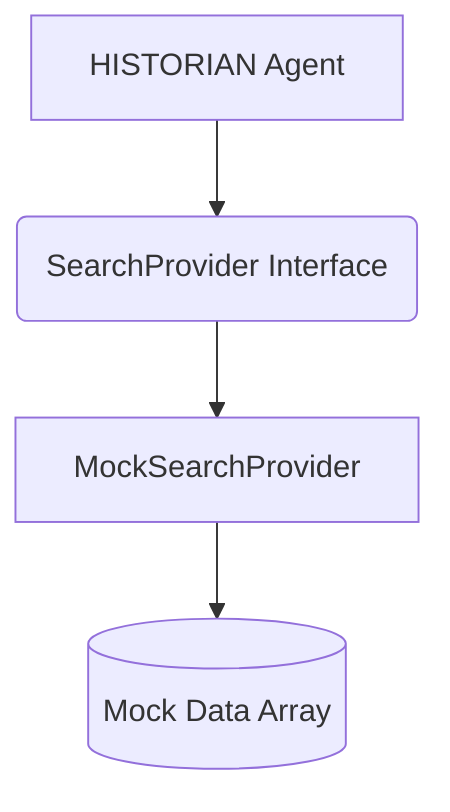
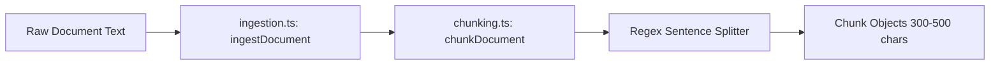
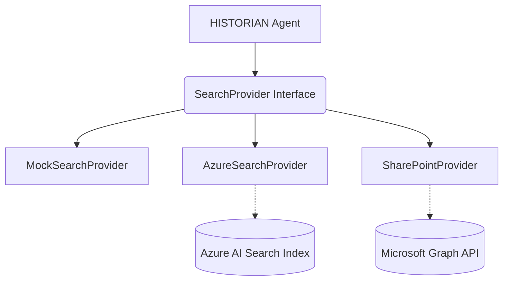

# FORESIGHT Phase 2 Architecture

This document outlines the architectural evolution of the FORESIGHT backend retrieval layer.

## Current State (Phase 1 to Phase 2 Transition)

In Phase 1, the `HISTORIAN` agent calculated TF-IDF scores directly against a mock in-memory array (`@foresight/mock-data`). 
In Phase 2, this logic has been decoupled behind a `SearchProvider` interface.

## Document Ingestion Pipeline

To prepare for future cloud indexing, a local chunking and ingestion pipeline has been established.

## Future Cloud Integrations (Phase 3+)

The `AzureSearchProvider` and `SharePointProvider` stubs exist to seamlessly swap the `MockSearchProvider` when Microsoft 365 and Azure environments are provisioned.

